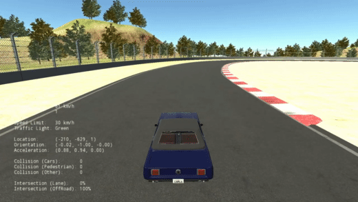

# Autonomous Driving with Longitudinal and Lateral Controllers

This project is to use lateral and longitudinal controllers to control the steering angle, throttle for a driving car on CARLA.

## Longitudinal Controller

PID controller is used to control the throttle position.

## Lateral Controller

Stanley controller is used to control the steering position. 

## Demo

